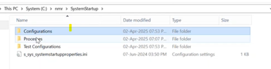

## BooStrap Overview

what is bootstrap?
It is an orchestrator that start-stops the processes(background, forground)/services in syncronized manner.

## Flow Diagram:


In the Digram above:
## Processmanager: 
It is the lowest level (it is window service), that provides the interfaces to start-stop the processes/services. And you can configure how you can start/stop processes.

Bootstrap is also a window service, that is client of processmanager.

## Bootstrap Service Role:
Bootstrap acts as the "brain" that manages startup sequences intelligently:
- **Startup Management**: Controls background and interactive process startup order
- **Dependency Control**: Ensures background services start before interactive ones
- **Crash Handling**: Monitors process health and handles failures
- **Process Orchestration**: Communicates with Process Manager to start/stop processes (e.g., "start process A")
- **Post-Startup Management**: Continues monitoring and managing processes after they start

*Key point* So here Process Manager is the one who actually starts/stops the processes, but Bootstrap tells Process Manager when and which processes to start/stop based on dependencies and system state.

Then we have Boot ConfigManager : It is first to come. It detects the user account and loads the user specific configuration for bootstrap. (For example in case of MRUser when we login we see an animation window, that is because of MRUser specific configuration loaded by BootConfigManager for bootstrap)

Then we have Small Component -> MR System State:

## System State Component:
A small but critical component that tracks and manages system health:
- **State Monitoring**: Tracks system status (normal, critical, scan in progress, etc.)
- **Critical State Detection**: Detects when critical processes crash during operations
- **User Notification**: Informs users when system enters critical state
- **Decision Prompting**: Asks users "System is in critical state. Do you want to proceed?"
- **State Management**: Maintains current system state for other components to query

*Example: If a critical process crashes during a scan, System State logs it as "critical" and prompts user for next action.*

Ui server: This is external component within coreservices that bootstrap uses to show the UI to user. For example when system goes into critical state, bootstrap uses Ui server to show the prompt to user. or for any progress bar.

## permproc: 

**permproc** is a command-line utility that acts as a client of Bootstrap, similar to Boot Config Manager. It's primarily a development tool that provides various functionalities to help users interact with the system. By default, when you type `permproc`, it lists all background processes.

Go to path:
C:\nmr\SystemStarup\


where configurations is for bootstrap and Process is for Process Manager.
Configurations contains set of processes. when you add any process and refresh the mrbootconigmanager, it will refelct the processes in the UI.
Configuration contains one background folder that contains all the .start files of background processes.


.start file contains the configuration of the process. It contains the following fields:
[Start]
Application =<alias of the process>
ActionOnStartupError =<numeric value> // during startup if this process fails what to do?
ActionOnCrashError =<numeric value> // After startup if this process crashes what to do?
// this Numeric value will be defined in the same file at the end.

SO bootstrap use the .start file where alias is mentioned so process manager can start the process using that alias. these alias files are present in SystemStartup\Processes folder.

.alias file sturcture:
```
<?xml version="1.0" encoding="UTF-8"?>
<Root>
  <!-- Alias name should be unique-->
  <Process Alias="initgantry">
    <!-- Name of the executable to be invoked-->
    <ProcessPath>initgantryproc_win_csm.exe</ProcessPath>
    <Description>ERUI Touch Device Manager</Description>
    <!-- Any command line paramaters to be passed to the executable. -->
    <InputParameters>
    </InputParameters>
    <!-- What should be the default working directoy for the created process. -->
    <StartupFolder>GYRO_ASSEMBLIES</StartupFolder>
    <!-- This optional value controls the priority class of the created process.
	   This is a DWORD value. The value is based on
	   the numeric value associated with the priority "#defines" used by
	   SetPriorityClass().
	   Refer to the entry in MSDN for SetPriorityClass() that contains a
	   table of the supported priority classes.
	   The following table contains a summary of some supported values.
		   NORMAL_PRIORITY_CLASS   0x00000020 (default when not provided)
		   IDLE_PRIORITY_CLASS     0x00000040
		   HIGH_PRIORITY_CLASS     0x00000080
		   REALTIME_PRIORITY_CLASS 0x00000100 -->
    <PriorityClass>0x00000020</PriorityClass>
    <!-- 0 = Background Process, 1 = Foreground Process -->
    <IsInteractive>0</IsInteractive>
    <!-- "minimum_working_set_size" and "maximum_working_set_size"
		The optional minimum_working_set_size and maximum_working_set_size
		entries contain the values for the working set that will be passed
		to the SetProcessWorkingSetSize() function that sets the minimum
		and maximum working set sizes for the specified process (alias).
		Both are of DWORD type. -->
    <MinProcessWorkingSetSize>
    </MinProcessWorkingSetSize>
    <MaxProcessWorkingSetSize>
    </MaxProcessWorkingSetSize>
    <!-- Any name value pairs in the [Environment Variables] section will be created
		when the process starts. They will only be valid in the context of the
		started process.
		eg    [Environment Variables]
			MyName1=MyValue1,MyName2=MyValue2,MyName3=MyValue3 -->
    <EnvironmentBlock>RECON_DIFFER_OUT-si_small_dif.log,RECON_TEST_ID-si_small,TRECWNT_EXE-trecwnt_nu.exe,P_PRFR_ALIAS_NAME-initgantry</EnvironmentBlock>
    <!-- 0 = exe, 1 = windows Service, 2 = command -->
    <ProcessType>0</ProcessType>
    <!-- 1 = RegisterProcess, 2 = ThirdParty, 3 = FireAndForget -->
    <BootstrapProcessType>1</BootstrapProcessType>
    <!-- In milliseconds. -->
    <StartupTimeout>120000</StartupTimeout>
    <!-- In milliseconds. -->
    <TerminateTimeout>60000</TerminateTimeout>
    <!-- Path to the tool used to invoke the executable -->
    <CommandExecutablePath>
    </CommandExecutablePath>
  </Process>
</Root>
```
So here alias is initgantry and process path is initgantryproc_win_csm.exe. so when bootstrap tells process manager to start initgantry, process manager will look for the alias in the .alias file and get the process path and start that process.