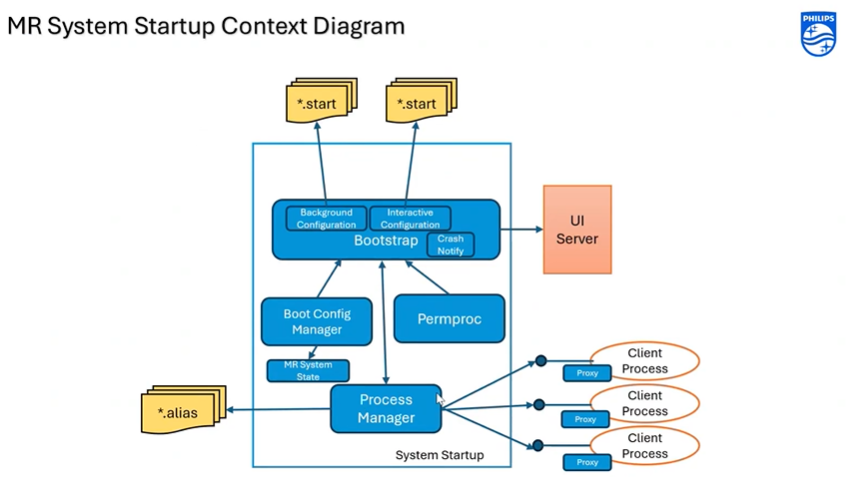

## BooStrap Overview

what is bootstrap?
It is an orchestrator that start-stops the processes(background, forground)/services in syncronized manner.

## Flow Diagram:

In the Digram above:
## Processmanager: 
It is the lowest level (it is window service), that provides the interfaces to start-stop the processes/services. And you can configure how you can start/stop processes.

Bootstrap is also a window service, that is client of processmanager.

## Bootstrap Service Role:
Bootstrap acts as the "brain" that manages startup sequences intelligently:
- **Startup Management**: Controls background and interactive process startup order
- **Dependency Control**: Ensures background services start before interactive ones
- **Crash Handling**: Monitors process health and handles failures
- **Process Orchestration**: Communicates with Process Manager to start/stop processes (e.g., "start process A")
- **Post-Startup Management**: Continues monitoring and managing processes after they start

*Key point* So here Process Manager is the one who actually starts/stops the processes, but Bootstrap tells Process Manager when and which processes to start/stop based on dependencies and system state.

Then we have Boot ConfigManager : It is first to come. It detects the user account and loads the user specific configuration for bootstrap. (For example in case of MRUser when we login we see an animation window, that is because of MRUser specific configuration loaded by BootConfigManager for bootstrap)

Then we have Small Component -> MR System State:

## System State Component:
A small but critical component that tracks and manages system health:
- **State Monitoring**: Tracks system status (normal, critical, scan in progress, etc.)
- **Critical State Detection**: Detects when critical processes crash during operations
- **User Notification**: Informs users when system enters critical state
- **Decision Prompting**: Asks users "System is in critical state. Do you want to proceed?"
- **State Management**: Maintains current system state for other components to query

*Example: If a critical process crashes during a scan, System State logs it as "critical" and prompts user for next action.*

Ui server: This is external component within coreservices that bootstrap uses to show the UI to user. For example when system goes into critical state, bootstrap uses Ui server to show the prompt to user. or for any progress bar.

## permproc: 

**permproc** is a command-line utility that acts as a client of Bootstrap, similar to Boot Config Manager. It's primarily a development tool that provides various functionalities to help users interact with the system. By default, when you type `permproc`, it lists all background processes.

Go to path:
C:\nmr\SystemStarup\
[SystemStartup Folder](../Images/BootstrapInConsole.png)