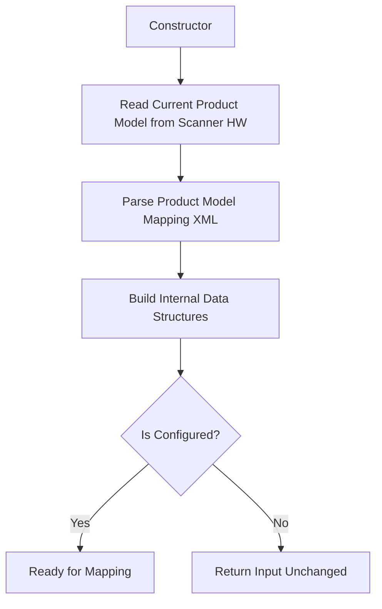

# Product Model Mapping System - Developer Notes

## 📋 Overview

The **Product Model Mapping System** is a translation layer that converts between internal technical product model names and external customer-facing product model names in MR (Medical Resonance) systems.

## 🎯 Problem Statement

**Challenge**: MR systems have different product names for different purposes:
- **Internal/System Names**: Technical names used in code (`"Ingenia Elition X"`)
- **External/Marketing Names**: Customer-facing names (`"Innovation Nova"`, `"Innovation Ultra"`)
- **Display Names**: UI-friendly names (`"Innovation"`)

**Solution**: Automatic mapping system that translates between these naming conventions.

---

## 🏗️ Architecture & Components

### Core Files Structure

```
mrconfiguration/
├── configurationtools/res/
│   └── p_add_productmodelmapping.pl     # Tool to add new mappings
├── inc/
│   └── ProductModelMappingParser.h      # Parser header
├── src/
│   ├── ProductModelMappingParser.cpp    # Parser implementation
│   └── MainEnumSpecialization.cpp      # Enum integration
├── res/
│   ├── p_cfg_productmodelmapping.xml    # Mapping configuration
│   └── p_cfg_productmodelpostfix.xml    # Postfix configuration
└── tst/
    └── productmodelmappingparser_gtest.cpp  # Unit tests

interfaces/icoreservices/imrconfiguration/inc/
└── IProductModelMappingParser.h         # Interface definition
```

---

## 📄 Configuration Files

### 1. `p_cfg_productmodelmapping.xml`
**Purpose**: Defines the mapping relationships between system and external product models.

```xml
<ConfigurationRepository Name="MRProductModelMappingConfiguration">
  <Object Name="Root">
    <CHILDREN>
        <Object>
            <Attribute Name="MappedProductModel">"Innovation Nova"</Attribute>
            <Attribute Name="SystemProductModel">"Ingenia Elition X"</Attribute>
            <Attribute Name="DisplayName">"Innovation"</Attribute>
        </Object>
        <!-- More mappings... -->
    </CHILDREN>
  </Object>
</ConfigurationRepository>
```

**Key Attributes**:
- `MappedProductModel`: External/customer-facing name
- `SystemProductModel`: Internal/technical name  
- `DisplayName`: UI display name

### 2. `p_cfg_productmodelpostfix.xml`
**Purpose**: Defines postfix suffixes for different product models.

```xml
<ConfigurationRepository Name="MRProductModelPostfix">
  <Object Name="Root">
    <CHILDREN>
        <Object>
            <Attribute ProductModel="Innovation Nova">_i30</Attribute>
            <Attribute ProductModel="Innovation Ultra">_i30</Attribute>
            <Attribute ProductModel="MR 7700 Nova">_7700</Attribute>
            <!-- More postfixes... -->
        </Object>
    </CHILDREN>
  </Object>
</ConfigurationRepository>
```

---

## 🔧 Core Implementation

### Class: `ProductModelMappingParser`

**Key Methods**:

```cpp
// Convert external/mapped model to system model
std::string GetSystemProductModel(const std::string& productModel);

// Convert system model to external/mapped model  
std::string GetMappedProductModel(const std::string& productModel);

// Get display name from mapped model
std::string GetDisplayNameFromMappedProductModel(const std::string& mappedProductModel);

// Get display name from system model
std::string GetDisplayNameFromSystemProductModel(const std::string& systemProductModel);
```

**Internal Data Structures**:
- `ProductModelsMultiMap systemProductModelsMultiMap`: System → [List of Mapped Models]
- `ProductModelsHashMap systemProductModelsHashMap`: (System, Mapped) → Mapped Model
- `ProductModelMappingInfoMap mappedProductModelInfoMap`: Mapped → Full Info

---

## 🔄 Data Flow

### Initialization Flow


### Mapping Flow
```
Input: "Innovation Nova" (External Name)
  ↓
GetSystemProductModel()
  ↓
Lookup in mappedProductModelInfoMap
  ↓
Output: "Ingenia Elition X" (Internal Name)
```

```
Input: "Ingenia Elition X" (Internal Name)
  ↓
GetMappedProductModel()
  ↓
Lookup in systemProductModelsMultiMap
  ↓
Output: "Innovation Nova" (External Name)
```

---

## 🛠️ Tools & Utilities

### `p_add_productmodelmapping.pl`
**Purpose**: Perl script to add new product model mappings to configuration.

**Usage**:
```bash
p_add_productmodelmapping.pl -f <productmodelmapping_file>
```

**What it does**:
1. Parses input XML file containing new mappings
2. Extracts Internal ↔ External product model pairs
3. Updates configuration XML files:
   - `Definitions.xml` and `Definitions_cdas.xml`
   - `MainValidation.xml`
   - `Rule.xml`

**Key Functions**:
- `UpdateDefinitionsXml()`: Updates definition files
- `UpdateMainValidationXml()`: Updates validation rules
- `UpdateRuleXml()`: Updates rule configurations

---

## 🔗 Integration Points

### Enum System Integration (`MainEnumSpecialization.cpp`)
**Purpose**: Automatic conversion for `AWASW_PRODUCT_MODEL_ENUM` values.

```cpp
// When converting enum to string - returns mapped (external) name
template <>
const char* getEnumText<AWASW_PRODUCT_MODEL_ENUM>(const AWASW_PRODUCT_MODEL_ENUM value)
{
    mappedString = getEnumInfo(...).getText(value);  // Get system name
    mappedString = IProductModelMappingParser::Instance()->GetMappedProductModel(mappedString);
    return mappedString.c_str();  // Return external name
}

// When converting string to enum - expects mapped (external) name
template<>
AWASW_PRODUCT_MODEL_ENUM stringToEnum<AWASW_PRODUCT_MODEL_ENUM>(const char* text)
{
    std::string str(text);
    str = IProductModelMappingParser::Instance()->GetSystemProductModel(str);  // Convert to system name
    int enumValue = getEnumInfo(...).getValue(str.c_str());
    return static_cast<AWASW_PRODUCT_MODEL_ENUM>(enumValue);
}
```

---

## 🧪 Testing

### Test Coverage (`productmodelmappingparser_gtest.cpp`)

**Test Categories**:
1. **Basic Functionality**:
   - Successful initialization
   - System ↔ Mapped model conversion
   - Display name retrieval

2. **Edge Cases**:
   - Empty strings
   - Special characters
   - Multiple mappings for same system model

3. **Error Handling**:
   - Invalid XML files
   - Missing configuration files
   - Empty mapping configurations

4. **Integration**:
   - Interface compatibility
   - Singleton behavior
   - Enum specialization

**Sample Test**:
```cpp
TEST_F(ProductModelMappingParserTest, SuccessfulInitialization)
{
    ProductModelMappingParser parser;
    
    // Test mapped → system conversion
    std::string result = parser.GetSystemProductModel("TestProductModel");
    EXPECT_EQ(result, "SystemModel1");
    
    // Test unmapped model (should return unchanged)
    result = parser.GetSystemProductModel("UnmappedModel");
    EXPECT_EQ(result, "UnmappedModel");
}
```

---

## 💡 Usage Examples

### Example 1: Basic Mapping
```cpp
auto parser = IProductModelMappingParser::Instance();

// Convert external name to internal name
std::string systemModel = parser->GetSystemProductModel("Innovation Nova");
// Result: "Ingenia Elition X"

// Convert internal name to external name
std::string mappedModel = parser->GetMappedProductModel("Ingenia Elition X");
// Result: "Innovation Nova"

// Get display name
std::string displayName = parser->GetDisplayNameFromMappedProductModel("Innovation Nova");
// Result: "Innovation"
```

### Example 2: Multiple Variants
```cpp
// Same system model can map to multiple external variants
// System: "Ingenia Elition X" can map to:
// - "Innovation Nova"
// - "Innovation Ultra" 
// - "Innovation Epic"

// The parser chooses based on current configured product model
std::string current = parser->GetMappedProductModel("Ingenia Elition X");
// Returns the variant matching current system configuration
```

---

## 🔍 Key Implementation Details

### XML Parsing Strategy
- Uses `tinyxml2` for XML parsing
- Robust error handling for malformed XML
- Supports quoted and unquoted attribute values
- Template-based parsing with validation chains

### Memory Management
- Uses smart pointers (`std::shared_ptr` / `boost::shared_ptr`)
- Singleton pattern for global access
- Proper cleanup in destructor

### Platform Compatibility
- Conditional compilation for Windows vs other platforms
- Uses `std::unordered_map` on Windows, `boost::unordered_map` elsewhere
- Custom hash functions for complex key types

### Performance Considerations
- Pre-built hash maps for O(1) lookups
- Multi-map structure handles one-to-many relationships
- Lazy initialization pattern

---

## 🚨 Important Notes

### Configuration Requirements
1. **Scanner HW Repository**: Must contain current product model
2. **Mapping Configuration**: Must be properly structured XML
3. **Environment Variables**: `GYRO_SITE` and `GYRO_CONFIG` must be set

### Error Handling
- **Graceful Degradation**: Returns input unchanged if mapping fails
- **Logging**: Uses `OSLOG_error` and `OSLOG_info` for diagnostics
- **Validation**: Checks for duplicate keys and invalid structures

### Maintenance Guidelines
1. Always use the Perl script to add new mappings
2. Test thoroughly after configuration changes
3. Maintain postfix consistency across related models
4. Update validation rules when adding new system models

---

## 🔄 Common Workflows

### Adding New Product Model Mapping
1. Create XML file with new mapping:
   ```xml
   <Object>
       <Attribute Name="MappedProductModel">"New External Name"</Attribute>
       <Attribute Name="SystemProductModel">"New System Name"</Attribute>
       <Attribute Name="DisplayName">"New Display"</Attribute>
   </Object>
   ```

2. Run Perl script:
   ```bash
   p_add_productmodelmapping.pl -f new_mapping.xml
   ```

3. Test the mapping:
   ```cpp
   auto parser = IProductModelMappingParser::Instance();
   std::string result = parser->GetSystemProductModel("New External Name");
   // Should return "New System Name"
   ```

### Debugging Mapping Issues
1. Check log files for `ProductModelMappingParser` entries
2. Verify XML file structure and syntax
3. Ensure environment variables are correctly set
4. Test with unit tests to isolate issues

---

*Last Updated: October 27, 2025*